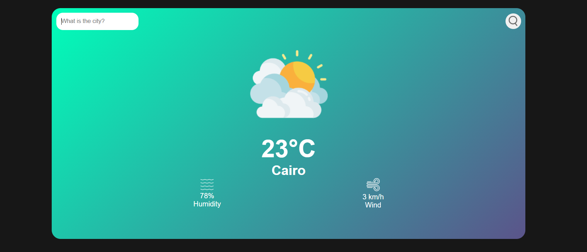

# Weather App ⛅

تطبيق بسيط وسهل الاستخدام لعرض حالة الطقس في أي مدينة حول العالم.  
يعتمد على **OpenWeather API** لجلب البيانات، ويعرض درجة الحرارة، نسبة الرطوبة وسرعة الرياح بشكل مباشر، مع تصميم عصري ومتجاوب.

---

## 🔗 Live Demo  
👉 https://weather-app-m33.vercel.app/

## 🗂️ GitHub Repository  
👉 https://github.com/ahmed-moatemed/weather-app

---

## 📸 Preview




---

## 🚀 Features
- البحث عن الطقس لأي مدينة حول العالم  
- جلب البيانات من **OpenWeather API**  
- عرض:  
  - درجة الحرارة  
  - الرطوبة  
  - سرعة الرياح  
  - حالة السماء (Sunny / Clouds / Rain…)  
- تنبيهات عند إدخال مدينة غير موجودة  
- تصميم سلس وخفيف  
- Responsive بالكامل على الموبايل والتابلت

---

## 🛠️ Technologies Used
- **HTML5**
- **CSS3**
- **JavaScript (ES6+)**
- **Fetch API**
- **OpenWeather API**

---

## 📦 Installation & Run Locally

```bash
# Clone repository
git clone https://github.com/ahmed-moatemed/weather-app.git

# Open the project
cd weather-app

# Run the app
Open index.html in your browser
```

---

## 📝 Notes
- تحتاج اتصال بالإنترنت لعمل API.  
- يمكنك تطوير المشروع بإضافة:  
  - 5-day forecast  
  - تغيير الواجهة حسب حالة الطقس  
  - نظام Units (Celsius / Fahrenheit)  
  - Dark Mode  

---

## ✨ Author
Developed by **Ahmed Ibrahim Moatemed**  
📧 matamedahmed@gmail.com  
🔗 Portfolio: https://mo3temed.netlify.app/
